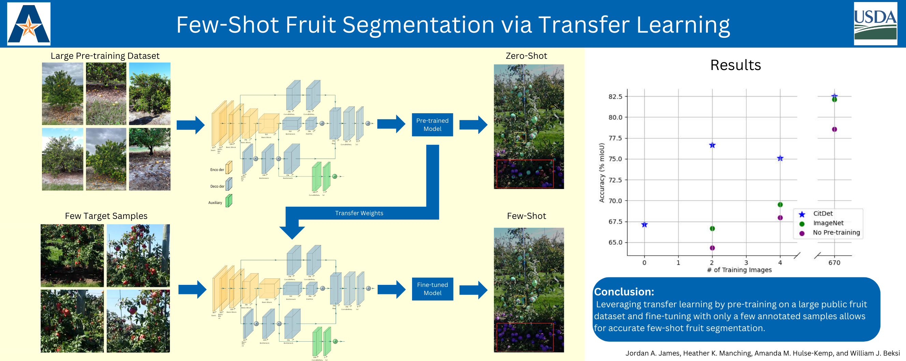
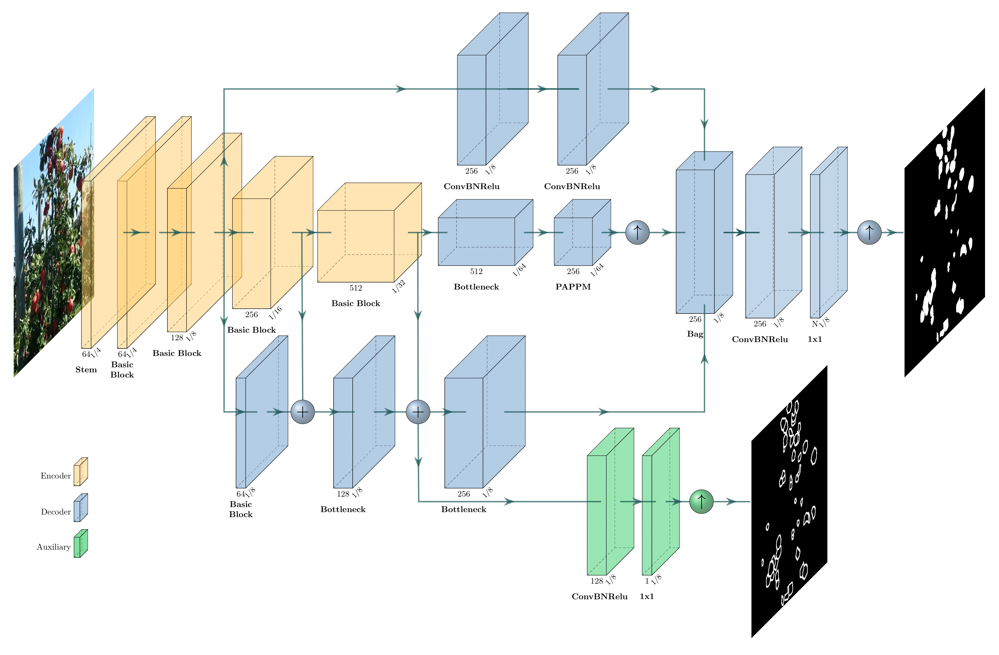

## Few-Shot Fruit Segmentation via Transfer Learning

### Overview

Advancements in machine learning, computer vision, and robotics have paved the
way for transformative solutions in various domains, particularly in
agriculture. For example, accurate identification and segmentation of fruits
from field images plays a crucial role in automating jobs such as harvesting,
disease detection, and yield estimation.  However, achieving robust and precise
infield fruit segmentation remains a challenging task since large amounts of
labeled data are required to handle variations in fruit size, shape, color, and
occlusion. 

<p align="center">
  
</p>

This repository provides source code for our 2024 ICRA paper titled "[Few-Shot
Fruit Segmentation via Transfer Learning](https://arxiv.org/pdf/2405.02556)."
Our light-weight three-branch decoder effectively learns task specific
boundaries enabling knowledge transfer of learned shapes and boundaries between
tasks. By leveraging pre-trained neural networks, we demonstrate that accurate
semantic segmentation of fruit in the field can be achieved with only a few
labeled images. In addition, we show that models with pre-training learn to
distinguish between fruit still on the trees and fruit that have fallen on the
ground, and they can effectively transfer the knowledge to the target fruit
dataset.

### Citation

If you find this project useful, then please consider citing our work.

```bibitex
@inproceedings{james2024few,
  title={Few-Shot Fruit Segmentation via Transfer Learning},
  author={James, Jordan A and Manching, Heather K and Hulse-Kemp, Amanda M and Beksi, William J},
  booktitle={Proceedings of the IEEE International Conference on Robotics and Automation (ICRA)},
  pages={13618--13624},
  year={2024}
}
```

### Model Architecture

<p align="center">

</p>

### Installation

First, begin by cloning the project

    $ git clone https://github.com/robotic-vision-lab/Few-Shot-Fruit-Segmentation-Via-Transfer-Learning.git
    $ cd Few-Shot-Fruit-Segmentation-Via-Transfer-Learning

Then, set up a Python 3 environment by installing Pytorch (1.0.1 or higher) and
TorchVision. Finally, install the remaining packages:

    $ pip install -r requirements.txt

### Training, Evaluation, and Visualization

Scripts for training, evaluating, and visualizing the network are provided in
the tools folder.

### Evaluation Results

The evaluation results on the MinneApple test set are shown below.

| Pre-Training | Training Images | Test mIoU (%)| Test Accuracy (%)
|:-:|:-:|:-:|:-:|
| CitDet | 0 | 67.2 | 97.3
| None | 2 | 64.3 | 96.1
| ImageNet | 2 | 66.7 | 95.8
| CitDet | 2 | 76.7 | 98.0
| None | 4 | 67.9  | 96.1
| ImageNet | 4 | 69.5 | 96.9
| CitDet | 4 | 75.1 | 98.1
| None | 670 | 78.6 | 98.3
| ImageNet | 670 | 82.1 | 98.7
| CitDet | 670 | 82.5 | 98.7

### Acknowledgments

Our implementation is based on [PIDNet](https://github.com/XuJiacong/PIDNet) and [HRNet-Semantic-Segmentation](https://github.com/HRNet/HRNet-Semantic-Segmentation).

### License

[](https://github.com/robotic-vision-lab/Few-Shot-Fruit-Segmentation-Via-Transfer-Learning/blob/main/LICENSE)

